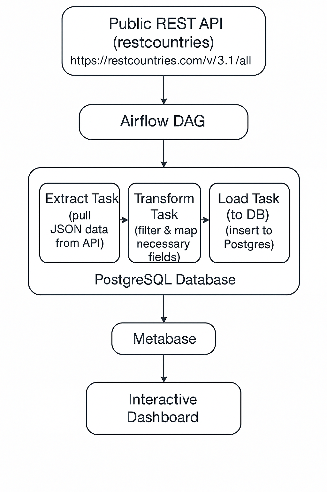

## Data Integration from a public REST API for countries information

This project involved integrating data from a public REST API for countries information. This data will be used by a travel agency to recommend travel destinations to customers based on some different factors like language, continents, regions, currency and many more. The world country data is extracted from https://restcountries.com/v3.1/all.
The project is divided into two parts:
- The ETL pipeline orchestrated with airflow, and
- Data visualization with Metabase

All setup is done with Docker using [Docker-compose file](./docker-compose.yaml) for Airflow, Postgres database, and Metabase. A custom docker image (custom_airflow) was built for this project using the [Dockerfile](./Dockerfile). The custom image include apache/airflow:3.0.1, pip packages found in [requirements file](./requirements.txt), and embedded python files and dag. The custom docker image is pushed to docker hub and can be accessed via [this link](https://hub.docker.com/repository/docker/olalekanrasaq/custom_airflow/).

Below is the architectural flow of the project:

### ETL Pipeline
The ETL part of the project is divided into three part:
- Extracted data from the Rest API
- Transformed the data and retrieve fields of interest
- Loaded the transformed data into PostgreSQL database.

The ETL pipeline workflow is orchestrated with airflow. [See DAG file](./dags/country_info_dag.py) for the ETL pipeline code orchestrated in airflow.

### Visualization
Metabase is connected to the PostgreSQL database for visualization and execution of queries. The dashboard visual, which contains the answer to the project questions, can be accessed [here](./WorldCountryDashboard.pdf). The sql queries used to provide the visuals can also be found [here](./dags/template/sql/queries.sql)

